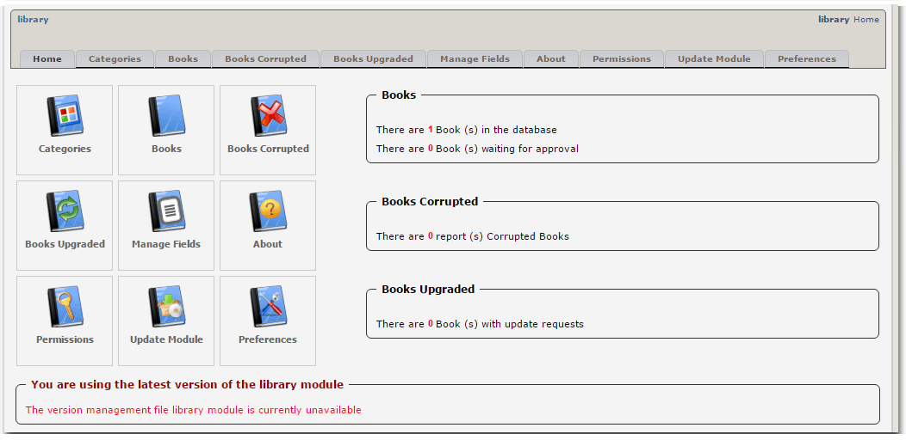
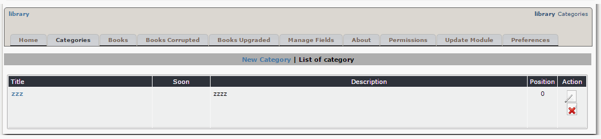
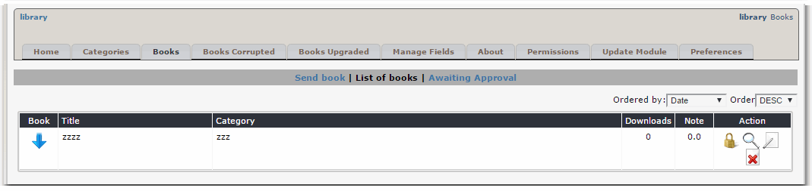
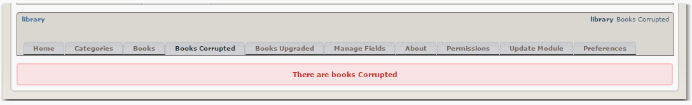
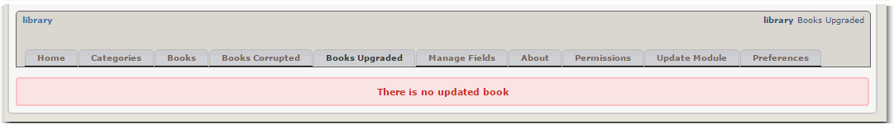
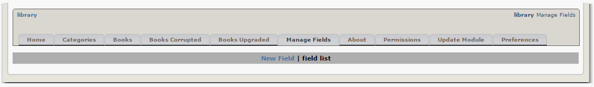
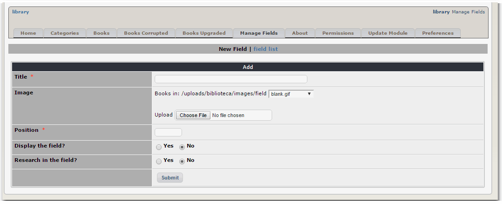
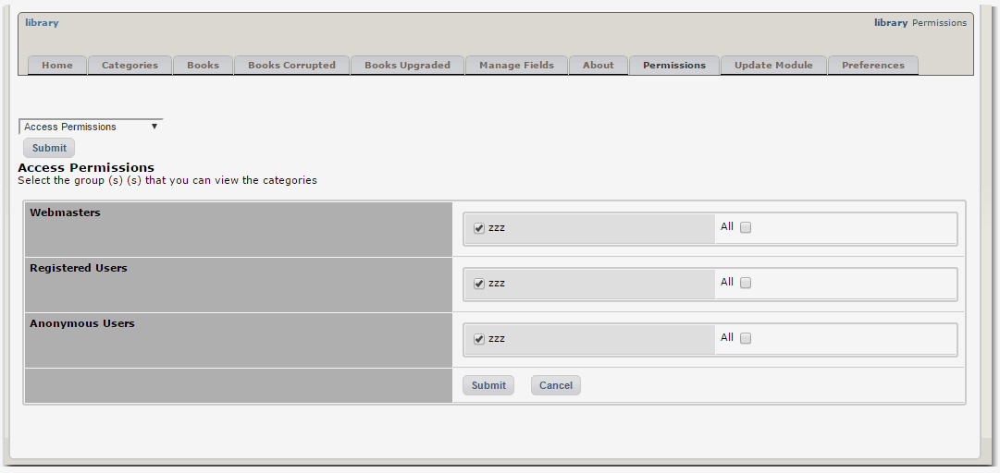
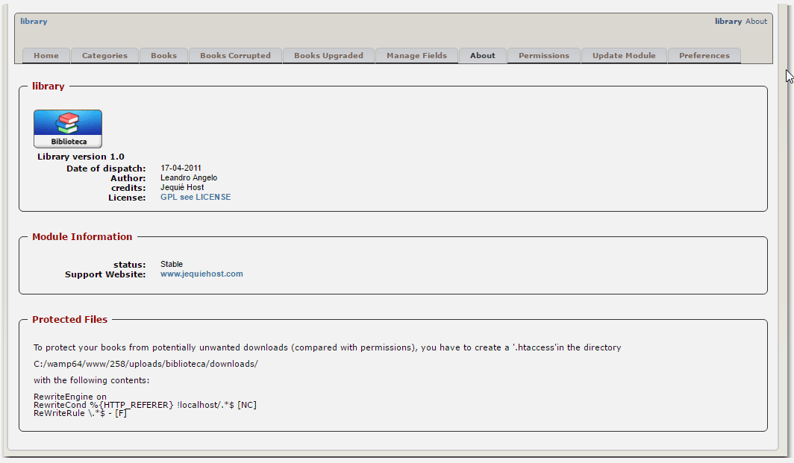

# 2.0 Administration Menu

Let's take a look at the individual Tabs:

In the Categories, you can Add and Edit categories for the books. Once you don't need a category, you can delete it.

Here you can enter your Books, modify them, and delete them.

If users report books or their links as "corrupted", you'll see them here.

If users provide an "update" to individual books , you'll see them here.

Sometimes you need to add a new field to the book. This is the place where you can do it - just click on the link: "New Field". This will open the form below:

Here you can define the new field

With Permissions, you'll be able to decide WHO will be able to do WHAT with this module. You can create Groups with specific rights (e.g. Member, Editor, Owner, etc.) and add individual users to a Group with the appropriate permissions. 

This Tab shows you the info about the module version, the developers, and the changelog. 

